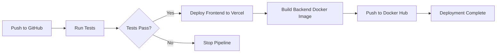

# Vercel + GitHub Actions CI/CD Setup Guide

## 📋 Overview

This guide explains how to set up automated CI/CD using:
- **Vercel** for frontend deployment (automatic, zero-config)
- **GitHub Actions** for testing and backend deployment

---

## 🚀 Quick Setup Steps

### Step 1: Connect GitHub Repository to Vercel

1. Go to [vercel.com](https://vercel.com) and sign in
2. Click **"Add New Project"**
3. Import your GitHub repository: `jinger666/blog-agent`
4. Configure project settings:
   - **Framework Preset**: Vite
   - **Root Directory**: `frontend`
   - **Build Command**: `npm run build`
   - **Output Directory**: `dist`
5. Add environment variables in Vercel dashboard:
   ```
   VITE_API_URL=https://your-backend-url.com/api
   ```
6. Click **Deploy**

### Step 2: Get Vercel Tokens

1. Go to Vercel Dashboard → Settings → Tokens
2. Create a new token with name: `GitHub Actions Token`
3. Copy the token value

4. Find your Organization ID and Project ID:
   - Go to your Vercel project
   - Settings → General
   - Copy **Organization ID** and **Project ID**

### Step 3: Add GitHub Secrets

Go to your GitHub repository → Settings → Secrets and variables → Actions → New repository secret

Add these secrets:

| Secret Name | Value | Description |
|------------|-------|-------------|
| `VERCEL_TOKEN` | Your Vercel token | From Step 2 |
| `VERCEL_ORG_ID` | Your org ID | From Vercel project settings |
| `VERCEL_PROJECT_ID` | Your project ID | From Vercel project settings |
| `DOCKER_USERNAME` | Docker Hub username | For backend images |
| `DOCKER_PASSWORD` | Docker Hub password/token | For backend images |

### Step 4: Test the Pipeline

Push to `main` branch:
```bash
git add .
git commit -m "Setup Vercel CI/CD"
git push origin main
```

Watch the pipeline run in GitHub Actions tab!

---

## 🔄 How It Works

### Pipeline Flow



### What Happens on Each Push

1. **Test Job** (runs on every push/PR):
   - Runs backend linting
   - Executes unit tests
   - Uploads coverage reports

2. **Build & Deploy Job** (only on `main` branch):
   - Deploys frontend to Vercel automatically
   - Builds backend Docker image
   - Pushes image to Docker Hub

---

## ⚙️ Configuration Files

### `.github/workflows/ci-cd.yml`
Main CI/CD pipeline configuration

### `frontend/vercel.json`
Vercel-specific configuration:
- Build settings
- API rewrites (proxy `/api/*` to backend)
- Security headers
- Environment variables

---

## 🔧 Alternative: Automatic Vercel Deployment

Vercel can auto-deploy without GitHub Actions! This is simpler:

### Option A: Pure Vercel (Recommended for Frontend)

1. Connect GitHub repo to Vercel (Step 1 above)
2. Every push to `main` automatically triggers Vercel deployment
3. No GitHub Actions needed for frontend!

**Benefits:**
- ✅ Zero configuration
- ✅ Preview deployments for PRs
- ✅ Automatic rollbacks
- ✅ Built-in analytics

### Option B: Hybrid (Current Setup)

Use GitHub Actions for:
- Running tests before deployment
- Backend Docker builds
- Complex deployment logic

Use Vercel for:
- Frontend hosting
- CDN distribution
- Edge functions

---

## 🌍 Environment Variables

### Frontend (.env.example)
```env
VITE_API_URL=http://localhost:3000/api
```

### Backend (.env.example)
```env
MONGODB_URI=mongodb://localhost:27017/ai-blog
REDIS_URL=redis://localhost:6379
JWT_SECRET=your-secret-key
OPENAI_API_KEY=sk-your-key
DIFY_API_KEY=app-your-key
DIFY_API_URL=https://api.dify.ai/v1
PORT=3000
```

---

## 🐛 Troubleshooting

### Issue: Vercel deployment fails

**Solution:**
1. Check Vercel deployment logs
2. Verify environment variables are set
3. Ensure `VITE_API_URL` points to correct backend URL

### Issue: GitHub Actions can't authenticate with Vercel

**Solution:**
1. Regenerate Vercel token
2. Update `VERCEL_TOKEN` secret in GitHub
3. Verify token has proper permissions

### Issue: CORS errors after deployment

**Solution:**
Update backend CORS configuration to allow Vercel domain:
```typescript
// backend/src/index.ts
app.use(cors({
  origin: ['https://your-app.vercel.app', 'http://localhost:5173'],
  credentials: true
}));
```

---

## 📊 Monitoring

### Vercel Dashboard
- Real-time deployment status
- Analytics and performance metrics
- Function logs

### GitHub Actions
- Pipeline execution history
- Test results
- Build artifacts

---

## 🎯 Best Practices

1. **Use Preview Deployments**: Vercel creates unique URLs for each PR
2. **Set Up Branch Protection**: Require CI to pass before merging
3. **Use Environment Variables**: Never hardcode sensitive data
4. **Monitor Deployments**: Set up alerts for failed deployments
5. **Test Locally First**: Run `npm run build` before pushing

---

## 🔗 Useful Links

- [Vercel Documentation](https://vercel.com/docs)
- [GitHub Actions Docs](https://docs.github.com/en/actions)
- [Vercel CLI Reference](https://vercel.com/docs/cli)
- [Docker Hub](https://hub.docker.com/)

---

## 💡 Pro Tips

1. **Automatic Domain**: Vercel provides `*.vercel.app` domain automatically
2. **Custom Domain**: Add custom domain in Vercel dashboard
3. **Edge Functions**: Use Vercel Edge Functions for API routes
4. **Incremental Static Regeneration**: Perfect for blog content
5. **Analytics**: Enable Vercel Analytics for traffic insights

---

**Need Help?** Check the logs in:
- GitHub Actions → Select workflow → View logs
- Vercel Dashboard → Deployments → View build logs
